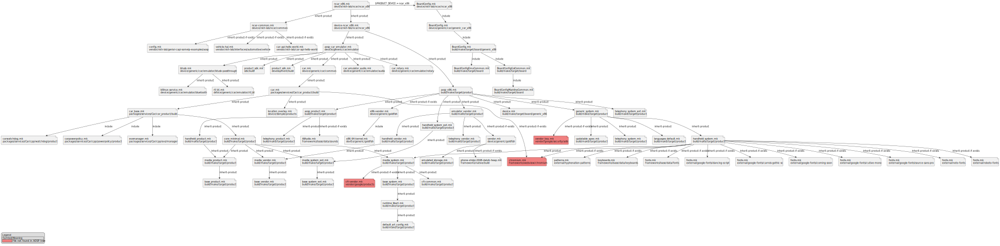

## Intro
Python-based tool project for parsing AOSP device mk file dependencies for lunch target and presenting output in [PlantUML](https://plantuml.com/en/) format.

## CI Status
[](https://github.com/nkh-lab/aosp-devicemk-parser/actions/workflows/ci.yml)

## How to use
Script should be run from AOSP tree for sourced lunch target. For example:
```
$ . ./build/envsetup.sh
$ lunch ncar_x86-userdebug
$ cd vendor/nkh-lab/tools/devicemk-parser/
```
And run the script:
```
$ python parse_devicemk.py
Parsing make files dependencies...
device/nkh-lab/ncar/ncar_x86.mk
device/nkh-lab/ncar/ncar_x86/BoardConfig.mk
device/generic/car/emulator/aosp_car_emulator.mk
build/make/target/product/aosp_x86.mk
device/nkh-lab/ncar/ncar_x86/device-ncar_x86.mk
device/generic/car/generic_car_x86/BoardConfig.mk
device/generic/car/common/car.mk
...
build/make/target/product/base_vendor.mk
build/make/target/product/runtime_libart.mk
build/make/target/product/default_art_config.mk
============================================
Parsed files: 72, Warnings: 0, Time spent: 0m 13s
Generated output:
PUML: /home/mykola/Projects/my/ncar/vendor/nkh-lab/tools/devicemk-parser/ncar_x86.puml
```
For more options, see the script help:
```
$ python parse_devicemk.py -h
```
## Output examples
Following output examples were obtained from parsing [NCAR - Android Automotive Emulator](https://github.com/nkh-lab/aosp-ncar-manifest) AOSP project for `ncar_x86-userdebug` target:
- [PlantUML output file](doc/output-examples/ncar_x86.puml)
- [text output file](doc/output-examples/ncar_x86.txt) (more for tool debugging needs)

The following is an example of graphical PlantUML presentation, where [PlantUML output file](doc/output-examples/ncar_x86.puml) was converted into SVG image by using [PlantUML Extension for Visual Studio Code](https://marketplace.visualstudio.com/items?itemName=jebbs.plantuml) (also output file can be converted using [PlantUML online interpreter](https://www.plantuml.com/plantuml/uml/SyfFKj2rKt3CoKnELR1Io4ZDoSa70000)):



[Link to full size image](https://raw.githubusercontent.com/nkh-lab/aosp-devicemk-parser/master/doc/output-examples/ncar_x86.svg)

## Useful links
- [PlantUML Home page](https://plantuml.com/en/)
- [PlantUML Online Interpreter](https://www.plantuml.com/plantuml/uml/SyfFKj2rKt3CoKnELR1Io4ZDoSa70000)
- [PlantUML Extension for VSCode](https://marketplace.visualstudio.com/items?itemName=jebbs.plantuml)
- [SVG Preview Extension for VSCode](https://marketplace.visualstudio.com/items?itemName=SimonSiefke.svg-preview)